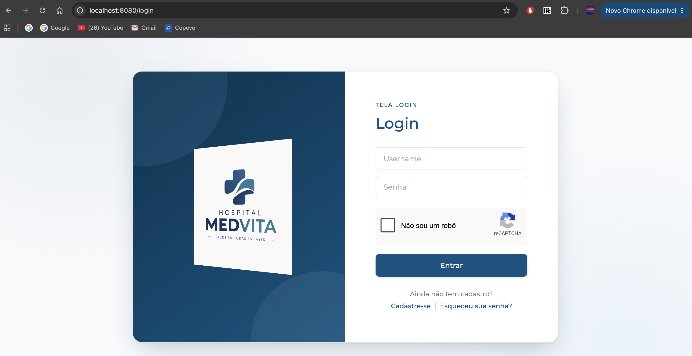
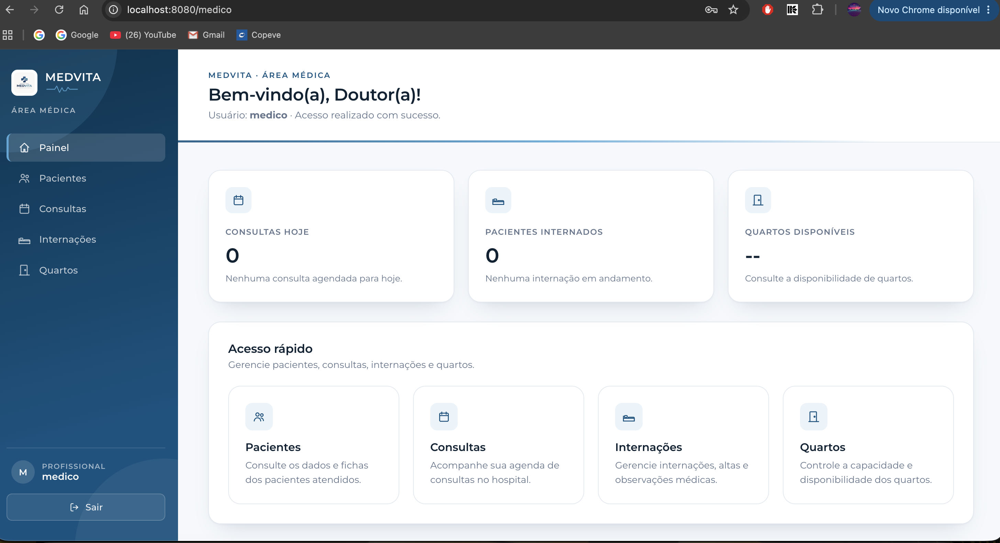
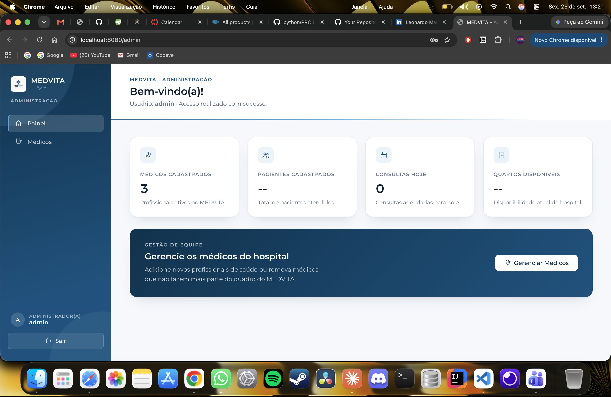

# MedVita — Sistema Hospitalar

Trabalho prático da disciplina de **Programação Modular**.

O MedVita é um sistema web de gestão hospitalar. Pacientes, médicos e administradores entram pela mesma tela de login e cada um é levado para a sua própria área.



## Telas

### Portal do Paciente
Depois do login, o paciente vê a próxima consulta, as internações ativas e o histórico. Também tem acesso rápido para agendar consultas e ver os próprios dados.


### Área Médica
O médico acompanha as consultas do dia, os pacientes internados e a disponibilidade de quartos.



### Administração
O administrador vê um resumo do hospital e gerencia o quadro de médicos.



## Funcionalidades

- **Login com reCAPTCHA** (Google reCAPTCHA v2, o "Não sou um robô").
- **Três perfis de acesso** (paciente, médico e administrador). Cada perfil só abre as próprias páginas e, depois do login, vai direto para a sua área.
- **Cadastro de paciente** com nome, e-mail, CPF, endereço, telefone, data de nascimento e senha.
- **Recuperação de senha por e-mail.** O usuário recebe um link para criar uma nova senha, válido por 15 minutos.
- **Senhas criptografadas** com BCrypt.

> **Em desenvolvimento:** os usuários ainda ficam só na memória, então quem se cadastrar é apagado quando o servidor reinicia. Os números dos painéis (consultas, internações, quartos) ainda não vêm de dados reais.

## Tecnologias

- Java 17
- Spring Boot 3.3.5 (Web, Security, Thymeleaf, Mail)
- Google reCAPTCHA v2
- Maven

## Como rodar

### 1. Pré-requisitos

- JDK 17 ou superior
- Maven

### 2. Criar o arquivo `.env`

Crie um arquivo `.env` dentro da pasta `MedVita/` com as variáveis abaixo. Ele não vai para o Git.

```properties
MAIL_USERNAME=seu-email@gmail.com
MAIL_PASSWORD=sua-senha-de-app
RECAPTCHA_SITE_KEY=sua-site-key
RECAPTCHA_SECRET_KEY=sua-secret-key
```

- **MAIL_PASSWORD** é uma *senha de app* do Gmail, não a senha normal da conta. Para gerar uma, ative a verificação em duas etapas e acesse <https://myaccount.google.com/apppasswords>.
- **Chaves do reCAPTCHA:** crie em <https://www.google.com/recaptcha/admin>, escolhendo o tipo **v2 "Não sou um robô"** e adicionando `localhost` como domínio.

### 3. Iniciar

```bash
cd MedVita
mvn spring-boot:run
```

Depois, acesse <http://localhost:8080>.

### Usuários de teste

Esses usuários estão definidos em [`application.properties`](MedVita/src/main/resources/application.properties):

| Perfil        | Usuário                    | Senha   |
|---------------|----------------------------|---------|
| Administrador | `admin`                    | `1234`  |
| Médico        | `medico`                   | `12345` |
| Paciente      | `leo.euricobete@gmail.com` | `4321`  |

## Estrutura do projeto

```
Sistema_Hospitalar/
├── DOCUMENTOS/                # documentos do trabalho (diagramas, relatórios...)
├── IMAGENS/                   # capturas de tela usadas neste README
└── MedVita/                   # aplicação Spring Boot
    └── src/main/
        ├── java/com/example/MedVita/
        │   ├── application/   # classe principal (TelaLoginApplication)
        │   ├── config/        # Spring Security, reCAPTCHA e usuários
        │   ├── controller/    # rotas das páginas
        │   ├── exception/     # tratamento de erros
        │   └── service/       # usuários, e-mail, recuperação de senha
        └── resources/
            ├── static/        # CSS e imagens
            └── templates/     # páginas HTML (login, paciente, medico, admin)
```

Os documentos do trabalho ficam em `DOCUMENTOS/`, cada tipo na sua própria pasta (ex.: `DOCUMENTOS/DiagramaUML/arquivo`).
